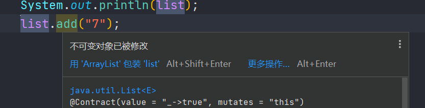

## 快速创建只读集合

### 概述

调用集合中静态方法 of()，可以将不同数量的参数传输到此工厂方法中。此功能可用于 Set 和 List，也可用于 Map 的类似形式。此时得到 的集合，是不可变的

* List.of
* Set.of
* Map.of


### 使用

```java
package mao;

import java.util.List;

/**
 * Project name(项目名称)：JDK9_quickly_create_read_only_collection
 * Package(包名): mao
 * Class(类名): Test1
 * Author(作者）: mao
 * Author QQ：1296193245
 * GitHub：https://github.com/maomao124/
 * Date(创建日期)： 2023/10/31
 * Time(创建时间)： 16:33
 * Version(版本): 1.0
 * Description(描述)： 无
 */

public class Test1
{
    public static void main(String[] args)
    {
        List<String> list = List.of("1", "2", "3", "4", "5", "6");
        System.out.println(list);
        //list.add("7");
    }
}
```


尝试更改：




```sh
[1, 2, 3, 4, 5, 6]
Exception in thread "main" java.lang.UnsupportedOperationException
	at java.base/java.util.ImmutableCollections.uoe(ImmutableCollections.java:142)
	at java.base/java.util.ImmutableCollections$AbstractImmutableCollection.add(ImmutableCollections.java:147)
	at mao.Test1.main(Test1.java:24)
```


```java
package mao;

import java.util.Set;


public class Test2
{
    public static void main(String[] args)
    {
        Set<String> set = Set.of("1", "3", "2");
        System.out.println(set);
    }
}
```


```sh
[3, 2, 1]
```


```java
package mao;

import java.util.Map;


public class Test3
{
    public static void main(String[] args)
    {
        Map<String, String> map = Map.of("a1", "b1", "a2", "b2", "a3", "b3");
        System.out.println(map);
    }
}
```


```sh
{a3=b3, a2=b2, a1=b1}
```


